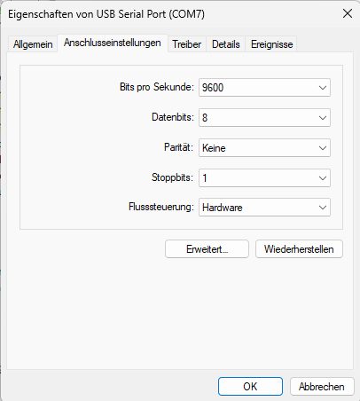

# LPKF Protomat 91s/VS Information

## Project Description

This repository documents the restoration and operation of an LPKF Protomat 91s/VS (manufactured in 1999), discovered at our university and revived for educational use and prototyping. The machine had not run since around 2016, and initial efforts focused on understanding its hardware and software requirements.

### Background & Progress

- **Discovery & Initial State:** The machine was found unused, with little available documentation or expertise. Original software (BoardMaster 5.0 and CircuitCAM 5.0) was available, but running it on modern systems proved challenging.
- **Software & Communication:** After obtaining a compatible version of BoardMaster for Windows 11, basic axis movement was achieved. Direct control via serial terminal (e.g., VS Code Serial Monitor, PuTTY) is also possible, bypassing the need for BoardMaster.
- **Hardware Repairs:** A blown fuse in the spindle driver was replaced, restoring spindle functionality. Attaching a pen to the spindle carriage allowed successful drawing of BoardMaster example patterns.
- **Current Status:** The machine is operational for basic movement and drawing tasks. Documentation and resources are being collected in this GitHub repository.

---

## controller.py – Graphical Control Software

`controller.py` is a Python-based graphical application for controlling the LPKF Protomat 91s/VS via serial connection or in emulation mode.
It is a proof-of-concept and not fully tested. Use with caution.

### Features

- **Serial Connection:** Select and configure the serial port (baudrate, parity, stop bits, flow control).
- **Emulation Mode:** Test all commands and GUI features without hardware. Simulates position and head state.
- **Command Terminal:** Send arbitrary commands and view sent/received data in a terminal-like window.
- **Quick Commands:** Buttons for initialization, pen up/down, motor enable/disable, and position query.
- **Relative Movement:** Move the head in X/Y directions by a configurable step size (mm) using arrow buttons.
- **Absolute Movement:** Move to a specific X and/or Y position (mm) using input fields and buttons.
- **Workspace Limit:** Set the maximum X and Y workspace (mm) to prevent out-of-bounds movement.
- **Visualization:** See a live plot of the workspace and the current head position. The marker color indicates:
  - **Green:** Pen up
  - **Orange:** Pen down
  - **Red:** Motor enabled
- **Command Flow:** Enter and execute a sequence of commands as a single flow.
- **Automatic Safety:** Prevents movement into negative or out-of-bounds workspace.
- **Automatic Disconnect:** Serial port is closed automatically when the application exits.

### Usage

1. **Install Requirements:**Install Python 3 and the `pyserial` package:

   ```bash
   pip install pyserial
   ```bash
2. **Start the Application:**

   ```bash
   python controller.py
   ```bash
3. **Connect to the Machine:**

   - Select the correct COM port and settings.
   - Click "Connect" to open the serial connection.
   - Use "Emulation Mode" to test without hardware.
4. **Move the Head:**

   - Use the arrow buttons for relative moves.
   - Enter absolute positions and use the corresponding buttons.
   - Set workspace limits to match your machine.
5. **Send Commands:**

   - Use the input field below the terminal to send custom commands.
   - Use the command buttons for common actions.
6. **Monitor State:**

   - The terminal shows all sent and received data.
   - The workspace plot shows the current position and head state.

### Known Limitations

- Not all error cases are handled gracefully.
- No support for loading/saving command sequences or settings yet.
- Some features (e.g., spindle control) are not implemented.
- Only basic commands are supported.

---

## ToDo

- Add a configuration/description file to load commands dynamically and store user preferences.
- Improve error handling and user feedback.
- Add support for more advanced features (e.g., tool change logic, spindle).
- Add file import/export for command flows.

---

## Setting Up the Serial Connection

### Using a Serial Terminal to Move the Machine

You can use the Serial Monitor in VS Code, or any other serial terminal application such as PuTTY.
The commands are found in the Manual of the Protomat 92s/VS.

- [PuTTY: a free SSH and Telnet client](https://www.chiark.greenend.org.uk/~sgtatham/putty/)

### COM Port Settings (Windows)

Configure the COM port in Windows Device Manager for the USB-Serial adapter connected to the machine.

**Recommended settings:**

- **Baud rate:** 9600
- **Data bits:** 8
- **Parity:** None
- **Stop bits:** 1
- **Flow control:** Hardware (RTS/CTS)



### Serial Communication Setup

To establish communication:

1. Connect a serial cable to the 25-pin connector on the Protomat 91s/VS.
2. Use a 25-pin to 9-pin (DB25 to DB9) adapter.
3. Connect the DB9 end to a USB-Serial adapter.
4. Plug the USB adapter into your PC and identify the COM port in Device Manager.

---

## Working Commands

Below are the main commands for controlling the machine. All distances are in micrometers (µm), unless otherwise noted.

### Initialization

| Command | Description                                                                           |
| ------- | ------------------------------------------------------------------------------------- |
| `IN;` | Initializes the device (homes axes, resets state). Always send before other commands. |

---

### Echo Mode

| Command   | Description                                               |
| --------- | --------------------------------------------------------- |
| `!CT0;` | Disable echo mode (no confirmation after commands).       |
| `!CT1;` | Enable echo mode (returns `"C\cr"` after each command). |

---

### Pen Control

| Command | Description              |
| ------- | ------------------------ |
| `PU;` | Pen up (no drawing).     |
| `PD;` | Pen down (drawing mode). |

---

### Movement

| Command    | Description                                                 | Example                                       |
| ---------- | ----------------------------------------------------------- | --------------------------------------------- |
| `PRx,y;` | Move relative by x and y (in µm) from current position.    | `PR1500,0;` moves 1.5cm in x direction.     |
| `CIr;`   | Draw circle with radius r (in µm) around current position. | `CI1500;` draws a circle with 1.5cm radius. |

---

### Position Query

| Command   | Description                                   | Return Example                               |
| --------- | --------------------------------------------- | -------------------------------------------- |
| `!ON0;` | Query position of all axes (returns X, Y, Z). | `P19100,9000,0C` (X: 19100, Y: 9000, Z: 0) |
| `!ON1;` | Query X position                              |                                              |
| `!ON2;` | Query Y position                              |                                              |
| `!ON3;` | Query Z position                              |                                              |

---

### Example: Draw a Rectangle with 5cm Side Length

This command sequence draws a rectangle with 50mm (5cm) sides, starting from the current position:

```text
!TS500;PD;PR5000,0;PR0,5000;PR-5000,0;PR0,-5000;PU;!TS0;
```

**Step-by-step explanation:**

1. Set tool speed to 500 (unit depends on device): `!TS500;`
2. Lower the pen to start drawing: `PD;`
3. Move 5cm (5000µm) in x direction: `PR5000,0;`
4. Move 5cm in y direction: `PR0,5000;`
5. Move back 5cm in x direction: `PR-5000,0;`
6. Move back 5cm in y direction: `PR0,-5000;`
7. Lift the pen: `PU;`
8. Reset tool speed to default: `!TS0;`

## Currently Not Working

### Motor Control

| Command   | Description                                  |
| --------- | -------------------------------------------- |
| `!EM1;` | Enable motor (required for movement).        |
| `!EM0;` | Disable motor (stops movement, saves power). |

## Notes

- All commands must end with a semicolon (`;`).
- Always initialize the device before sending movement or drawing commands.
- Use echo mode for easier debugging and confirmation of command execution.
- Units for movement and drawing are always micrometers (µm), unless otherwise specified.
